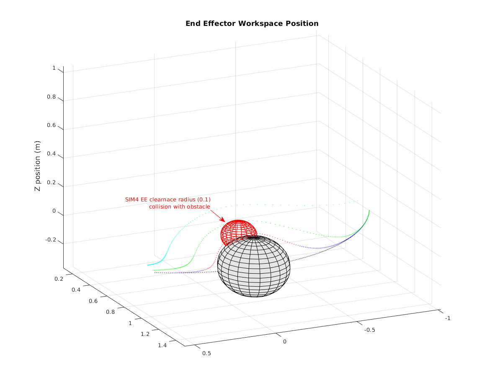

# Supplemental Figures

For clarity in the paper submission, obstacle representations are omitted. 
The figures below provide additional views of the scenarios in the paper including obstacles.
Matlab(.fig) files added, matlab scripts (R2022b) for single static obstacle are in [zip file](./R2022b_ur10cbf_onerun.zip).

## Figure 2 - Trajectories using same parameters for different obstacles
![Common parameters [21 11], 0.2m radius obstacle](./fig2_0.2.svg)
![Common parameters [21 11], 0.3m radius obstacle](./fig2_0.3.svg)

## Figure 3 Trajectories of different parameter values

## Figure 4

